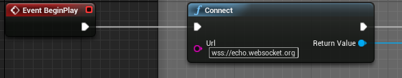
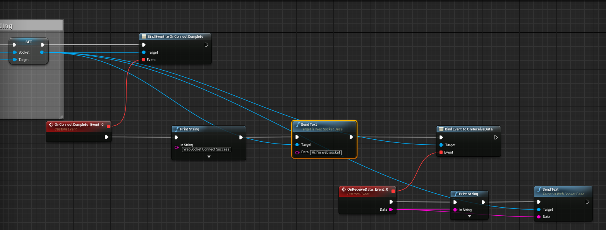

# UEWebsocket
unreal engine 4 websocket plugin(support ssl) for both c++ and blueprint developer.

This plugin is for unreal engine 4 c++ and blueprint developers, you can easily use c++ or blueprint
 to connect to remote server and send receive messages.
 
Unreal network is great for FPS or moba and IO games, but there's some games, you need to process network by yourself,
this plugin is for these people, you don't need to write any c++ code, 
the plugin support blueprint api to make json string from message object, and can also decode json to message object.

There's two level in the demo project, one for test websocket connect and send receive,
The other level is test message Object serialize to json string, and from json string to message object.
I did not use struct, because change a value of a struct in blueprint is not convenient.

# Supported Platform
★ 1. Win64

★ 2. Mac

★ 3. Android

★ 4. IOS

this plugin tested on 4.15, 4.16 and 4.17.

# Install
This is a normal plugin, if you are a beginner and don't know how to install it, 
please watch the video on my [another plugin](https://github.com/feixuwu/UnrealEngine4-Admob).
If you have any problem, please email me:feixuwu@outlook.com

# Usage
★ Connect To Server

   
   
★ Bind Event, Send And Receive Data

   
   
★ Generate message class

   When you work for a large game project, you can't write all message data class yourself, you need to use tools to generate
   message class.
   Under the ProtoTool/ there's a tool to generate cpp code for unreal engine 4 and d.ts for nodejs type info.
   I like use nodejs as my game server, the client and server communicate with json message.
   The proto write with js format, there's a example "message.js", you can run the "generatetue4.bat" to generate class.
   
★ Object to json

   
   
★ Json to Object

   

# License
This is an open source project, you can use it free. If you think this project useful, please give me a star to let me know 
it is useful, so I'll continue make it better.
